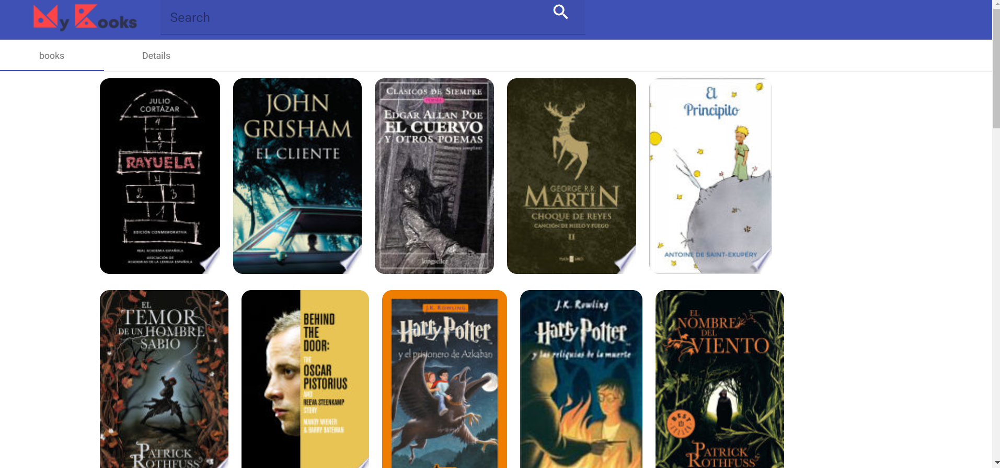

# MyBooksUi


This is the user interface of the my-books project, which shows the books that you have read and allows you to search and add new books as a CRUD.
In future releases it will be possible to scale and implement new functionalities such as:
- Login and profile
- Book recommendations according to categories and authors.
- Trade of books with other users

## Getting Started

These instructions will get you a copy of the project up and running on your local machine for development and testing purposes.

### Prerequisites

- docker
- node
- angular cli

### Install

- Clone this repo
```sh
$ git clone https://github.com/AlfredoMarino/my-books-ui.git
```
 - Execute Docker compose to start the entire my-books ecosystem (database, backend, and frontend)
```sh
$ cd my-books-ui
$ docker-compose up
```

At this point, you can already test the application since the last docker image of this application is running. Go to http://localhost/

If you need to run the test environment follow the following steps:

```sh
$ npm install

$ npm run start
```
In this way, the test environment will be started on port 4200 and this environment will point to the backend already started by docker-compose on port 5000. Check in your browser http://localhost:4200/

Enjoy it ;)




## Related projects

+ [my-books-service](https://github.com/AlfredoMarino/my-books-service)
+ [my-books-mysql](https://github.com/AlfredoMarino/my-books-mysql)
+ [my-books-gke](https://github.com/AlfredoMarino/my-books-gke)
+ [My docker-hub](https://hub.docker.com/u/aamv)

## Contributing

Pull requests are welcome.
